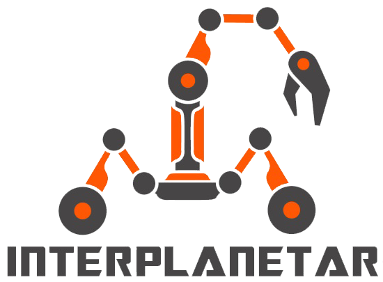

# [BUET-Interplanetar-Website](https://buetinterplanetar.com/) [](http://shields.io/) 



## Hosting
- Add `dbconnection.php` file inside `model` directory <br />
File format(`dbconnection.php`):
```
<?php
class DBConn {

    private $servername;
    private $username;
    private $password;
    private $dbname;
    private $charset;
    public function connect() {
        $this->servername = "<servername>";
        $this->username = "<username>";
        $this->password = "<password>";
        $this->dbname = "<db_name>";
        $this->charset = "utf8mb4";
        try {
            $dsn = "mysql:host=".$this->servername.";dbname=".$this->dbname.";charset=".$this->charset;
            $pdo = new PDO($dsn, $this->username, $this->password);
            $pdo->setAttribute(PDO::ATTR_ERRMODE, PDO::ERRMODE_EXCEPTION);
            return $pdo;
        } catch (PDOException $th) {
            $error_msg = "Connection failed: " . $th->getMessage();
        }
    }

}
```
- `servername` is either `localhost` or the "Shared IP Address" found in cPanel's main menu's right section 
- Upload the full repository contents inside `public_html`

[](https://GitHub.com/Naereen/) by <a href="https://github.com/Utshaw" target="_blank">Utshaw</a>
